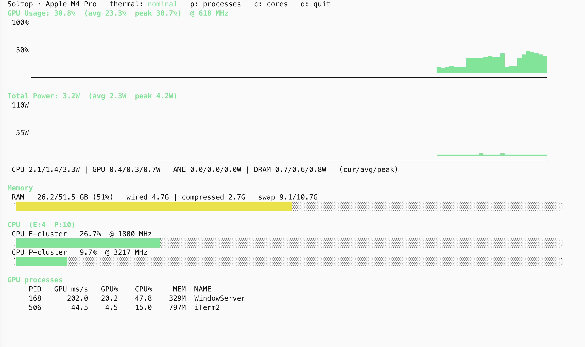

# soltop

[](https://github.com/charsyam/soltop/actions/workflows/test.yml)

Current version: **0.9.0**

**Which process is eating my GPU?** On Apple Silicon that question is
surprisingly hard to answer. `soltop` answers it — with a per-process GPU table
next to the system dashboard, and **without `sudo`**.

```
 GPU processes
      PID   GPU ms/s   GPU%    CPU%     MEM  NAME
      168      344.8   34.5    43.4    262M  WindowServer
      817       41.5    4.2    10.1    155M  Microsoft Teams
      506       33.8    3.4    35.9    916M  iTerm2
    43433       20.1    2.0    14.7    287M  Google Chrome He
```

Those are **GPU time**, not GPU memory — which process is actually keeping the
GPU busy. soltop reads the driver's own per-client accounting out of the
IORegistry, plus `IOReport` for the system-wide figures, so it runs with normal
user privileges. The only other tool that answers this question is
`powermetrics --show-process-gpu`, and it needs root.



## Why another one

The column that matters is the first one: **per-process GPU _time_** — which
process is actually keeping the GPU busy. The only other thing that answers that
is `powermetrics --show-process-gpu`, and it needs root.

| | per-process GPU **time** | system dashboard | no sudo |
|---|---|---|---|
| **soltop** | ✅ ms/s + % | ✅ CPU clusters, power, thermal | ✅ |
| [apple-smi](https://github.com/yeahdongcn/apple-smi) | ❌ device-wide only ¹ | partial (SoC power) | ✅ |
| [macmon](https://github.com/vladkens/macmon), [mactop](https://github.com/context-labs/mactop) | ❌ | ✅ | ✅ |
| [asitop](https://github.com/tlkh/asitop) | ❌ | ✅ | ❌ |
| `powermetrics --show-process-gpu` | ✅ | ✅ | ❌ |

¹ apple-smi does have a per-process table, but the figure in its "GPU Memory
Usage" column is the process's **RSS**, shelled out of `ps` — not GPU memory. No
tool can report true per-process GPU memory on this hardware: the driver's client
nodes expose only `IOUserClientCreator`, `AppUsage` and `CommandQueueCount`, and
no memory figure at all. soltop reports that same RSS and calls it **MEM**,
because Apple Silicon memory is unified and a process's RSS *is* what it costs
the SoC.

If you only want a system monitor, [macmon](https://github.com/vladkens/macmon)
is excellent and is a single Rust binary. Reach for soltop when you need to know
**which process** is on the GPU.

## Features

- **Per-process GPU table** — GPU ms/s and GPU%, plus each process's CPU% and
  memory. Read from the driver's IORegistry accounting, no sudo.
- **GPU** usage + frequency, with a live history graph
- **CPU** clusters: usage + frequency, with core counts (press `c` for a
  per-core breakdown). The layout is discovered, not assumed — an M4 Pro's E +
  P0/P1 and an M5 Pro's S + P0/P1 both come out right.
- **Power**: CPU / GPU / ANE / DRAM / Total (cur / avg / peak) + history graph
- **Memory**: used / wired / compressed / swap
- **SoC die temperature** (max / avg) with a history graph — the thermal state
  flag stays `nominal` while the die climbs 20 °C, so the trend is the early
  warning the flag is not
- **JSON / CSV / Prometheus** output for piping and dashboards
- Auto-fits the terminal size, boxed asitop-style UI

## Install

```sh
brew install charsyam/tap/soltop
```

## Usage

```sh
soltop              # live monitor
soltop -i 0.5       # sample every 0.5s
soltop --once       # print one frame and exit
soltop --version
```

While running:

| key | action |
|-----|--------|
| `p` | toggle the full GPU process list |
| `c` | toggle the per-core CPU view (every E/P core individually, instead of the cluster averages) |
| `q` | quit (`Ctrl-C` also works) |

Pressing the same key again returns to the dashboard.

## Machine-readable output

```sh
soltop --json                    # one JSON object per sample (JSONL)
soltop --json --once | jq .      # a single snapshot
soltop --csv > soltop.csv        # a header, then one row per sample
soltop --serve 9101              # Prometheus metrics at :9101/metrics
```

`--serve` binds **loopback** unless you give an address (`--serve 0.0.0.0:9101`) —
exporting hardware telemetry to the network should be deliberate. A background
thread samples continuously and scrapes read the latest snapshot, so a scrape
returns immediately and *N* scrapers cost no more than one.

```
soltop_gpu_utilization_percent 29.4
soltop_gpu_frequency_mhz 618
soltop_cpu_utilization_percent{cluster="P0"} 90.0
soltop_cpu_frequency_mhz{cluster="P0"} 4380
soltop_power_milliwatts{rail="cpu"} 1360.0
```

**An unknown clock is never exported as 0.** A parked cluster (macOS powers whole
CPU clusters down when idle) and a chip whose ladder soltop cannot read both have
*no* frequency — so JSON emits `null`, CSV leaves the field empty, and Prometheus
**omits the series entirely**. A zero would average cleanly and drag a dashboard
quietly towards nothing; an absent series is honest.

## Development

```sh
PYTHONPATH=src python3 -m unittest test_soltop     # tests
python3 -m zipapp src -o soltop -p "/usr/bin/env python3" -c   # what brew builds
./soltop --version
```

The package is split by concern, and the layering is one-way:

```
src/soltop/
  ffi.py            raw ctypes bindings (CoreFoundation, IOReport, IOKit, libc)
  core/
    dvfs.py         frequency ladders -- pure policy over the voltage-states tables
    power.py        which Energy Model channels to read, and their sanity bounds
    sampler.py      IOReport subscription; hands out raw residency/energy deltas
    cpu.py          cluster grouping and E/P/S tier naming
    gpu.py          GPU utilization and clock
    process.py      per-process GPU time
    system.py       memory, model name, thermal state
    temps.py        SoC die temperature (NOT a GPU temperature -- see the module)
    view.py         stitches cpu/gpu/power into the dict everything else consumes
  exporter/         JSON, CSV, Prometheus
  ui.py             terminal rendering and the live loop
  cli.py            argument parsing
```

`sampler.py` only *reads*; what the numbers mean is decided in `cpu.py` /
`gpu.py` / `power.py`. Homebrew ships this as a **single executable** — `zipapp`
packs the tree into one file, so there is still nothing to install but a script.

## Requirements

- Apple Silicon Mac (M1 or newer)
- macOS with the system `python3`

## Which Macs are verified

Frequencies are calibrated against `sudo powermetrics` on real hardware, and
Apple's IORegistry naming changes between generations — so "it runs" and "the
numbers are right" are different claims. What has actually been checked against
ground truth:

| chip | frequencies | clusters | power |
|---|---|---|---|
| M4 Pro | ✅ verified | ✅ E + P0/P1 | ✅ verified |
| M5 Pro | ✅ verified | ✅ S + P0/P1 | ✅ verified |
| everything else | ⚠️ unverified | ⚠️ unverified | ⚠️ unverified |

soltop is built to **degrade honestly** — on silicon whose tables it cannot
read it shows no clock rather than a wrong one — but that is a design goal, not
a measurement.

**Running an M1/M2/M3, or a Max/Ultra?** Two commands make your chip verified,
and take a minute:

```sh
python3 tools/dump_dvfs.py > mychip.txt
sudo powermetrics --samplers cpu_power -i 1000 -n 2 | grep "HW active frequency"
```

Open an issue with both outputs. That is exactly how M5 Pro support was built —
it turned out to have no efficiency cores at all, and to name its *Super* cores
`PCPU*`, the same prefix an M4 uses for its *performance* cores. No amount of
reasoning would have found that; the dump did, in one shot.

## Notes / accuracy

- No `sudo` and no `powermetrics` dependency.
- GPU utilization and power come from IOReport residency / energy counters;
  they track trends well but are approximations, not firmware-exact values.
- **The per-process GPU times are accurate, and under load they sum to the
  system-wide GPU%.** Measured against a Metal compute kernel pinning the GPU on
  an M4 Pro: the gauge reads 100% and the process rows add to 96–101%.

  They diverge *at idle* — the processes come to roughly half the gauge — and
  that is the two figures answering different questions rather than either being
  wrong. The gauge is P-state residency: how long the GPU was **awake**. A
  process's row is the time the driver **billed to that client**. Idle GPU work
  (compositing, a stray frame) wakes the GPU for a moment, and the ramp in and
  out counts as awake without being anyone's work. Under sustained load the GPU
  never sleeps, that overhead vanishes, and the two agree.
- **The temperature is the SoC die, not the GPU** — and no tool can give you a
  real GPU temperature on this hardware. There is no GPU-specific sensor: pinning
  the GPU with a Metal compute kernel on an M4 Pro moves the die sensors by about
  **+1 °C**, while pinning the CPU moves the same sensors by **+13 °C**. Other
  monitors look for a sensor whose *name* contains "GPU" and quietly report
  `0.0` when (as here) there is none. soltop reports the die, calls it `SoC`, and
  shows the **max** — the hottest spot is what the thermal governor reacts to.
- The process table's **MEM** is the process's RSS. Apple Silicon memory is
  unified, so that *is* the memory it costs the SoC — the GPU driver publishes
  no separate VRAM figure (per GPU client it exposes only the API, the
  accumulated GPU time, and the last submission time).
- **Frequencies are exact MHz**, for GPU and CPU alike. The GPU's
  `voltage-states` table holds plain Hz; the CPU's holds the *period* of each
  step, so `MHz = 65532288 / raw`. Verified against
  `sudo powermetrics --samplers cpu_power` on an **M4 Pro and an M5 Pro**: every
  step of every CPU ladder it prints is reproduced exactly.
- The reported clock is the **active-residency-weighted** one — `powermetrics`'
  "HW active frequency", i.e. the clock a core runs at while it is actually
  running, with idle excluded.
- **The cluster layout is discovered, never assumed.** Apple's IORegistry
  naming is not stable across chips: an M5 Pro has no efficiency cores at all
  (5 Super + 10 Performance), keeps its ladders under different
  `voltage-states` keys than an M4, and names its *Super* cores `PCPU*` — the
  same prefix an M4 uses for its *performance* cores. soltop therefore binds
  each cluster to its ladder by matching shape, and ranks the E/P/S tiers by
  their measured ceiling. On silicon it cannot read, it shows **no clock**
  rather than a fabricated one; utilization keeps working regardless. The raw
  captures behind this are in [`tools/fixtures/`](tools/fixtures/).
- A cluster that reads **0% with no clock is parked**, not broken — macOS powers
  whole CPU clusters down when idle.

## License

MIT — see [LICENSE](LICENSE).
